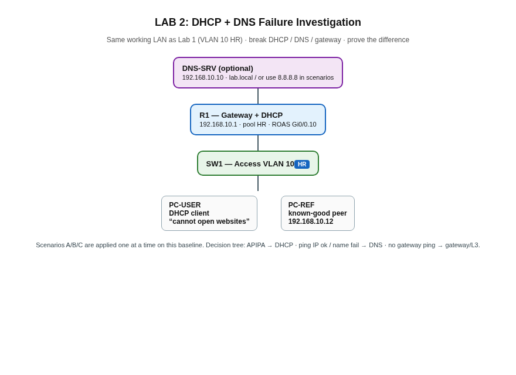

# LAB 2: DHCP + DNS Failure Investigation

NOC / IT Support portfolio lab. Most candidates can define DHCP and DNS. This repo shows you can **tell them apart when a user cannot browse**, using Packet Tracer and a fixed decision tree.

| | |
| --- | --- |
| **Author** | [Kazi Nafis Nawaz](https://github.com/kn2702-sys) · MCA (Networking) |
| **Platform** | Cisco Packet Tracer |
| **Series** | [LAB 1](https://github.com/kn2702-sys/enterprise-vlan-lab) · **LAB 2** · [LAB 3](https://github.com/kn2702-sys/LAB-3-Multi-Router-OSPF-Network) · [LAB 4](https://github.com/kn2702-sys/LAB-4-ACL-NAT-Internet-Edge) · [LAB 5](https://github.com/kn2702-sys/LAB-5-Site-to-Site-VPN-Firewall) · [LAB 6](https://github.com/kn2702-sys/LAB-6-Wireshark-NOC-Troubleshooting) · [LAB 7](https://github.com/kn2702-sys/LAB-7-NOC-Incident-Simulation) |
| **Skills** | DHCP · DNS · default gateway · APIPA · ICMP triage · ticket language |

> Portfolio / learning lab — not production employment.

---

## User complaint (ticket)

> “My laptop is connected to the network but I cannot access websites.”

Link light can be green while **DHCP**, **DNS**, or **gateway** is broken. Lab 2 forces all three, one at a time.

---

## Topology



Baseline: VLAN 10 (HR) from Lab 1 — R1 as DHCP + gateway `192.168.10.1`, SW1 access, one broken client (`PC-USER`), one known-good peer (`PC-REF`).

Optional: Packet Tracer Server `DNS-SRV` at `192.168.10.10` for Scenario B (misconfigured DNS). You can also use static DNS `8.8.8.8` vs a bogus DNS IP.

---

## What you prove

| Scenario | What you break | Classic symptom | Interview line |
| --- | --- | --- | --- |
| **A — DHCP failure** | Stop DHCP / wrong pool / wrong VLAN | `169.254.x.x` or no IP | “Client never got a lease.” |
| **B — DNS failure** | Bad/missing DNS while IP+gw OK | `ping 8.8.8.8` works, `ping google.com` fails | “L3 works; name resolution fails.” |
| **C — Gateway failure** | Wrong default gateway | Same-subnet peer may work; `ping 192.168.10.1` fails | “Host has an IP but no valid next hop.” |

That distinction is real L1 / NOC thinking.

---

## Decision tree (use in interviews)

```text
ipconfig / ifconfig
        │
        ├─ 169.254.x.x or no IP? ──────────────► Scenario A (DHCP)
        │         ├─ VLAN correct?
        │         ├─ DHCP server reachable?
        │         ├─ Pool / excluded addresses?
        │         └─ Relay (ip helper) if server off-subnet?
        │
        ├─ Valid IP + mask, but ping gateway fails? ► Scenario C (Gateway)
        │
        └─ ping gateway / 8.8.8.8 OK, ping by name fails? ► Scenario B (DNS)
```

Full break/fix steps: [`troubleshooting.md`](troubleshooting.md)  
Spoken ticket answers: [`INTERVIEW.md`](INTERVIEW.md)  
Baseline configs: [`configs/`](configs/)

---

## Quick start

1. Build Lab 1 **or** paste `configs/` into a minimal VLAN 10 topology (see [`BUILD.md`](BUILD.md)).
2. Confirm baseline: `PC-USER` gets `192.168.10.x`, pings gateway, pings `PC-REF`.
3. Run Scenario A → restore → B → restore → C → restore.
4. Capture screenshots listed in `screenshots/README.md`.

No `.pkt` binary in git — configs + docs are the source of truth.

---

## Repo layout

```text
dhcp-dns-failure-lab/
├── README.md
├── topology.png
├── BUILD.md
├── troubleshooting.md
├── INTERVIEW.md
├── configs/
│   ├── R1-dhcp.txt
│   ├── SW1.txt
│   └── DNS-SRV-notes.md
├── screenshots/
├── LICENSE
└── .gitignore
```

---

## License

MIT © 2026 Kazi Nafis Nawaz — [`LICENSE`](LICENSE)

## Contact

GitHub [kn2702-sys](https://github.com/kn2702-sys) · LinkedIn [kazi-nafis-nawaz-55b670393](https://www.linkedin.com/in/kazi-nafis-nawaz-55b670393) · kn2702@srmist.edu.in

